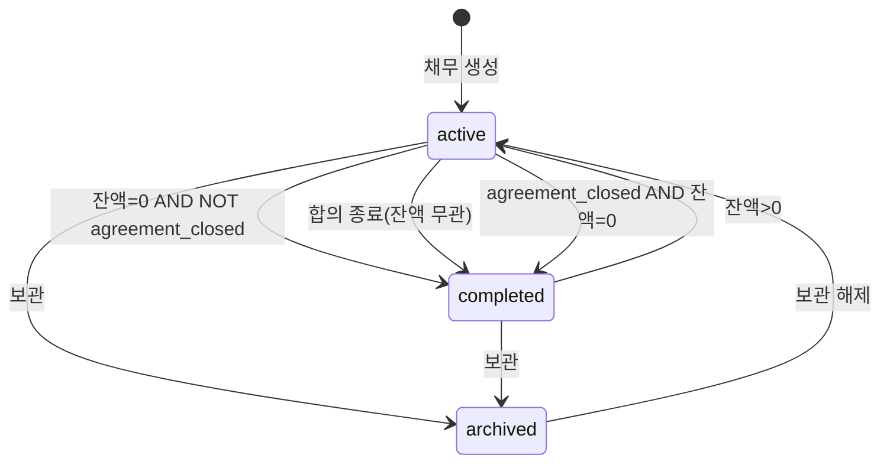

# payClear 데이터 모델 v0.1

| 항목 | 내용 |
|------|------|
| 버전 | v0.1.1 |
| PRD | v0.2.3 §4, §7 (+ P5b) |
| API | [contract-v0.1.md](../api/contract-v0.1.md) |

---

## 1. ER 개요

```
User 1──* Contact 1──* Debt 1──* LedgerEntry
                    └── optional ShareToken (1 active)
```

- 모든 비즈니스 데이터는 `user_id`로 테넌트 격리
- `Debt` 삭제(완전) 시 `LedgerEntry`, `ShareToken` CASCADE

---

## 2. 엔티티

### 2.1 users (인증 연동)

[ADR-002](../decisions/ADR-002-sns-auth-local-postgres.md): SNS OAuth → `oauth_accounts(provider, provider_user_id)` → `users.id`. Supabase 미사용. payClear 전용: 알림 설정, 삭제 예약 시각, `email`·`email_verified_at`.

### 2.2 contacts

| 컬럼 | 타입 | 규칙 |
|------|------|------|
| id | UUID | PK |
| user_id | UUID | FK |
| display_name | string | not empty |
| note | text | nullable, ≤500 |
| created_at / updated_at | timestamptz | |

동일 `display_name` **중복 허용**(P7).

### 2.3 debts

| 컬럼 | 타입 | 규칙 |
|------|------|------|
| id | UUID | PK |
| user_id | UUID | |
| contact_id | UUID | FK |
| direction | enum | `lent`, `borrowed` |
| principal | bigint | 불변(P3), KRW 원 |
| occurred_on | date | |
| reason | text | 1~500 |
| due_on | date | nullable |
| status | enum | `active`, `completed`, `archived` |
| agreement_closed | boolean | default false, 수동 완료 시 true(P5a) |
| completed_at | timestamptz | nullable |
| archived_at | timestamptz | nullable |
| created_at / updated_at | timestamptz | 낙관적 잠금 |

**저장하지 않음:** `balance`(항상 계산).

### 2.4 ledger_entries

| 컬럼 | 타입 | 규칙 |
|------|------|------|
| id | UUID | PK |
| debt_id | UUID | FK |
| type | enum | `payment`, `adjustment` |
| amount | bigint | payment: >0; adjustment: ≠0 |
| occurred_on | date | ≥ debt.occurred_on |
| note | text | adjustment 필수 |
| deleted_at | timestamptz | nullable(P1 soft delete) |
| created_at | timestamptz | P9 동일일 정렬 |

### 2.5 share_tokens

| 컬럼 | 타입 | 규칙 |
|------|------|------|
| id | UUID | PK |
| debt_id | UUID | FK |
| token | string | unique, opaque |
| pin_hash | string | nullable |
| anonymous | boolean | |
| expires_at | timestamptz | nullable |
| revoked_at | timestamptz | nullable |
| created_at | timestamptz | |

활성: `revoked_at IS NULL` AND (`expires_at IS NULL` OR `expires_at > now()`). **채무당 1활성**.

---

## 3. 잔액 계산

```
balance = principal
        + SUM(adjustment.amount WHERE NOT deleted)
        - SUM(payment.amount WHERE NOT deleted)
```

- API·UI는 **항상 서버 계산값** 반환
- 방향은 라벨만 변경(받을/갚을)

---

## 4. 상태 전이



### 4.1 status·라벨 규칙 (PRD P5·P5a·P5b)

| 조건 | status | display_label (UI) |
|------|--------|-------------------|
| `archived` | archived | — |
| `agreement_closed` AND `completed` | completed | **합의 종료** |
| NOT `agreement_closed` AND `completed` AND balance=0 | completed | **완료** |
| `active` (잔액任意) | active | — (**`agreement_closed=true`여도** active면 합의 종료 뱃지 **숨김**, X6) |
| `active` AND balance<0 | active | 잔액 「초과 상환」표기(X18) |
| `active` AND is_overdue | active | 연체 뱃지(별도) |

### 4.2 서버 갱신 트리거(개념)

**ledger 추가·삭제 후** 한 트랜잭션에서:

1. `balance` 계산
2. `agreement_closed=false` AND `balance=0` → `status=completed`, `completed_at=now`, label 완료
3. `agreement_closed=true` AND `balance=0` → `status=completed`, label 합의 종료 유지
4. `balance>0` AND `status=completed` → `status=active`, `completed_at=null` (X5,X6)
5. `balance<0` → `status=active`, 자동 완료 **안 함**(P6)
6. `is_overdue` = `status=active` AND `due_on`<today AND `balance>0`
7. `display_label` = P5b 규칙으로 API 필드 산출(저장 안 함)

**요약(F7) 집계:** `archived` 제외. `completed`+잔액>0(합의 종료) **포함**. balance<0은 해당 방향 합계에 **algebraic 합**(X18).

### 4.3 보관·공유

- `status→archived`: `share_tokens` 활성분 **revoke**
- ledger·share 생성 on archived → `DEBT_ARCHIVED`

---

## 5. 인덱스(권장)

- `debts(user_id, status)`
- `debts(user_id, contact_id)`
- `ledger_entries(debt_id, occurred_on)`
- `share_tokens(token)` unique

---

## 6. 관련 문서

- PRD §7.1 P1~P14, §7.6
- [acceptance-v0.1.md](../qa/acceptance-v0.1.md)
