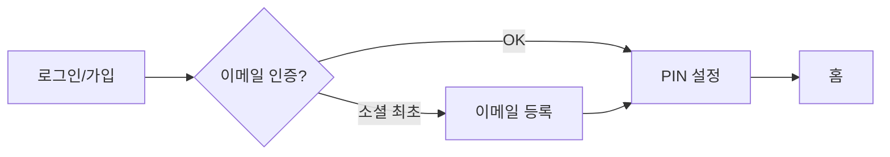
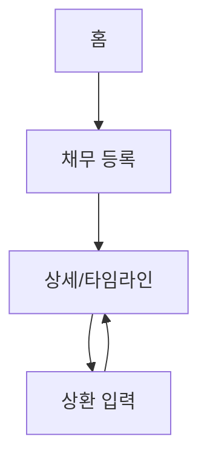
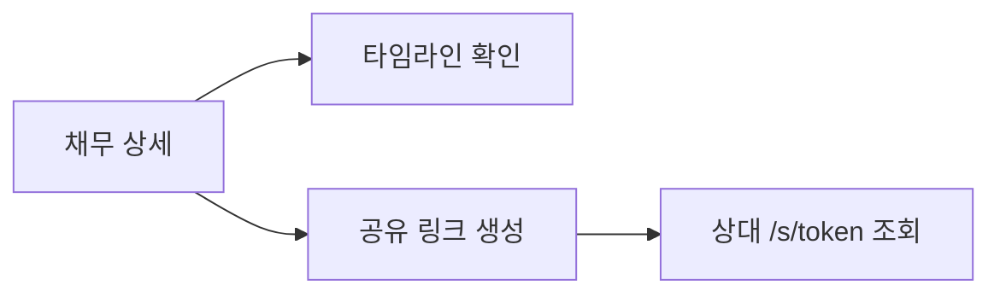
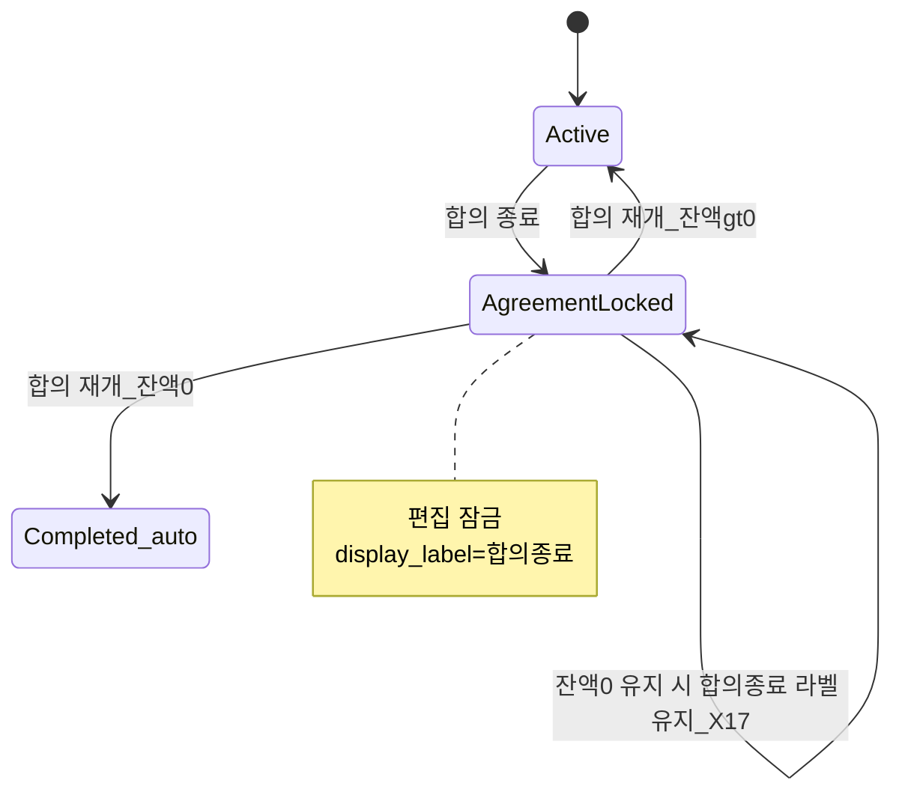

# payClear 사용자 플로우 v0.1

PRD §3.2·§3.3 기준. 상세 정책은 PRD §7.

---

## 1. 온보딩

---

## 2. 채무 등록·상환 (S1·S2)

---

## 3. 상대 설명 (S3·S7)

---

## 4. 합의 종료·재개 (E2·P5a·P5c·X20)

---

## 5. 알림 (S5)

- `due_on` 있는 **active** 채무
- D-1·당일 09:00 KST → Push 또는 이메일

---

## 6. 시나리오 ID 색인

| ID | 플로우 |
|----|--------|
| S1~S4 | §2 |
| S5 | §5 |
| S6 | [screen-spec §3.10](../design/screen-spec-v0.1.md) |
| S7 | §3 |
| E1~E8 | PRD §3.3, [acceptance](../qa/acceptance-v0.1.md) |
